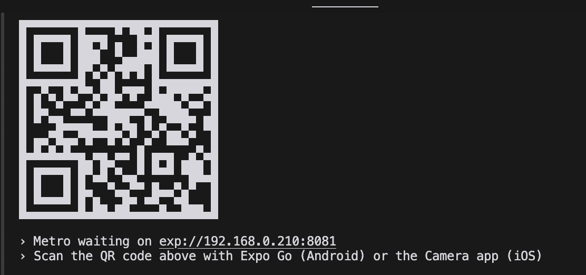
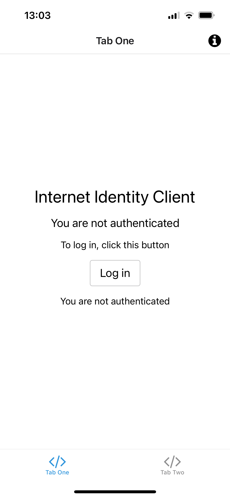
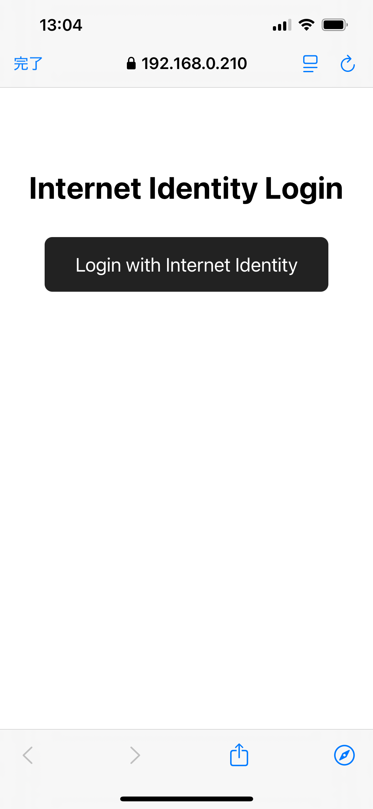
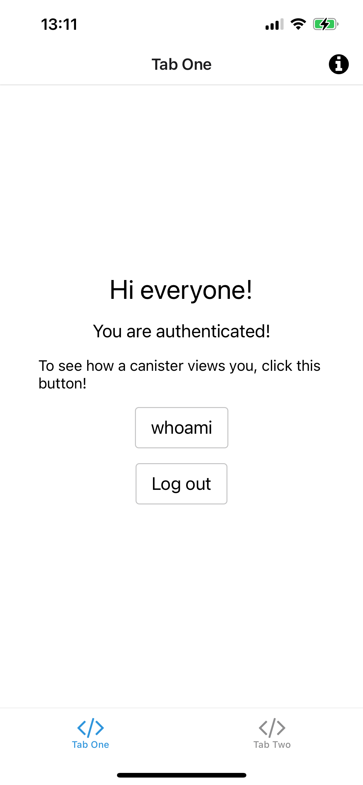
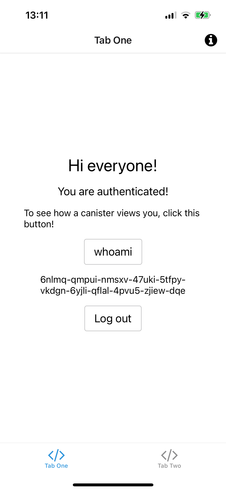
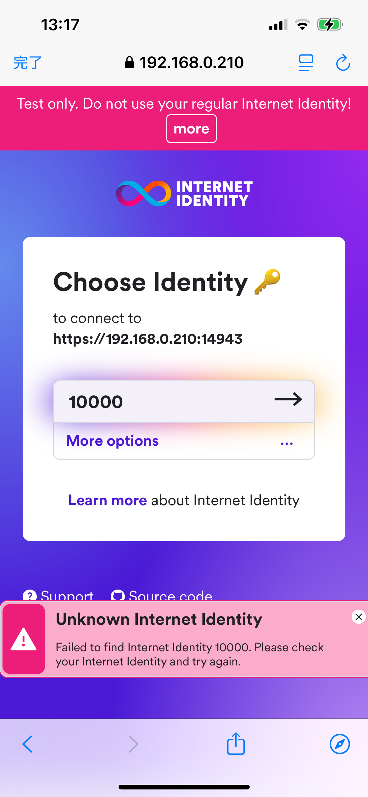

# Setup Instructions

The Japanese version is available [here](setup_ja.md).

## Required Environment
- Node.js version 18 or higher is required

## Installing Expo Go
Install the "Expo Go" app on your device:
- For iPhone/iPad users: Install from App Store
- For Android users: Install from Google Play Store

## mkcert Installation
mkcert is a tool for easily implementing HTTPS communication in local development environments.
Here's how to install and configure mkcert.

### macOS Installation
```bash
brew install mkcert
brew install nss # Required if using Firefox
```

### Root CA Setup
```bash
mkcert -install
```

### Check Root Certificate Location
```bash
mkcert -CAROOT
```

### Installing Root Certificate on iOS
- Send rootCA.pem file to iOS device
- Install from "Profile Downloaded" in Settings app
- Enable mkcert certificate in Settings → General → About → Certificate Trust Settings

### Installing Root Certificate on Android
- Transfer rootCA.pem file to Android device
- Go to Settings → Security → More → Install from storage
- Select and install as CA certificate

**Important Notes**
- nss installation is mandatory when using Firefox
- Never share generated key files
- Root certificate installation process may vary depending on Android device model

## Installing tiged
tiged is a useful tool that allows you to easily download specific parts of GitHub repositories.
Execute the following command to install tiged:
```bash
npm install -g tiged
```

## Downloading expo-starter project
Download the expo-starter project and move to the project folder with the following commands:
```bash
tiged higayasuo/icp-examples/expo-starter expo-starter
cd expo-starter
```

## Setting Up Rust and ICP Development Tools

### Command Execution
Execute the following commands to set up Rust and ICP development tools:
```bash
./scripts/setup.sh
```

### Verifying Setup
Run these commands to verify that the setup completed successfully:
```bash
rustc -V
dfx -V
```

If both commands display version information, the setup was successful.

**Notes**:
- When checking versions, make sure to use capital "V"
- Setup may take several minutes to complete
- After setup, run `exec $SHELL -l` to update shell paths

## Setting Up Subprojects
The expo-starter project consists of several subprojects.
Execute the following command to set up the subprojects:
```bash
npm run setup
```

## Setting Up Static IP Address
To access the development server on your PC from a smartphone, you need to set up a static IP address.
This ensures the IP address remains unchanged even after PC restart, enabling stable connectivity.

### macOS
1. Open "System Settings" from the Apple menu

2. Click "Network" in the sidebar

3. Select your active network connection (Wi-Fi or Ethernet) and click "Details"

4. Open the "TCP/IP" tab

5. From the "Configure IPv4" dropdown menu, select "Using DHCP with manual address" and enter the following:
    - IP Address
      - Recommended to use range 192.168.0.200-192.168.0.254 to avoid conflicts with DHCP dynamic assignments.
      For example, you could use 192.168.0.210.

## Creating Server Certificate
To enable HTTPS communication with the previously set static IP address, we'll create a server certificate.

### Preparation
```bash
mkdir .mkcert
cd .mkcert
```
Create and move to a dedicated folder for certificate storage.

### Certificate Creation
```bash
mkcert [static IP address]
```
The following files will be generated:
- [static IP address].pem - Server certificate
- [static IP address]-key.pem - Private key

### Completion
```bash
cd ..
```
Return to the original folder.

**Important Notes**
- Certificate validity period is 27 months
- Never share the private key
- Store certificates in a secure location

## local-ssl-proxy Configuration
Update the ssl:canisters, ssl:ii, and ssl:web entries in package.json with your configured static IP address.

### Updating package.json
```json
{
  "scripts": {
    "ssl:canisters": "local-ssl-proxy --key ./.mkcert/[static IP address]-key.pem --cert ./.mkcert/[static IP address].pem --source 14943 --target 4943",
    "ssl:ii": "local-ssl-proxy --key ./.mkcert/[static IP address]-key.pem --cert ./.mkcert/[static IP address].pem --source 24943 --target 4943",
    "ssl:web": "local-ssl-proxy --key ./.mkcert/[static IP address]-key.pem --cert ./.mkcert/[static IP address].pem --source 18081 --target 8081"
  }
}
```

Each configuration does the following:
- `--key`: Specifies the path to the private key file
- `--cert`: Specifies the path to the server certificate file
- `--source`: Port number used for HTTPS access
- `--target`: Port number where the actual development server is running

**Important Notes**
- Replace [static IP address] with the static IP address you configured earlier
- Ensure the server certificate and private key file paths match the location of files generated by mkcert

## Starting Local Replica
A local replica is a local execution environment for running Canisters.
Open a new terminal and execute the following command:
```bash
npm run dfx:start
```
The local replica will start on port 4943.

### How to Stop Local Replica
To stop the local replica, use either of these methods:
- Press Ctrl+C in the running terminal
- Execute `dfx stop` command in another terminal

**Important Note**
If you see the error `Error: dfx is already running.`, it likely means dfx start is already running. Stop the local replica with dfx stop first, then restart the development server.

## Deploying Canisters for local
To deploy Canisters to the local replica, execute the following command:
```bash
npm run dfx:deploy
```
This command performs the following:
1. Builds all Canisters (internet-identity, ii-integration, expo-starter-frontend, expo-starter-backend)
2. Installs the built Canisters to the local replica

**Important Notes**
- dfx:start must be running before deployment
- Deployment may take several minutes to complete

## Deploying Canisters for Playground
To deploy Canisters to the playground, execute the following command:
```bash
npm run dfx:deploy:playground
```
This command performs the following operations:
1. Builds all Canisters (internet-identity, ii-integration, expo-starter-frontend, expo-starter-backend)
2. Installs the built Canisters to the playground

**Important Notes**
- Deployment may take several minutes
- Deployed canisters expire after 20 minutes
- Playground deployments have the following limitations:
  - Maximum memory usage of 1GB
  - Cycle transfer instructions are ignored
  - Wasm files cannot be gzipped

## Preparation Steps for ICP Mainnet (ic) Deployment

1. Create and switch to a development identity
```bash
dfx identity new dev
dfx identity use dev
```

2. Check account information
```bash
dfx ledger account-id
dfx identity get-principal
```

3. Prepare for deployment
- Transfer a small amount of ICP to the displayed Account ID (recommended to have around 5 ICP)
- After the transfer, create a Canister with the following command
```bash
dfx ledger --network ic create-canister $(dfx identity get-principal) --amount 4
```

4. Configure the Cycles wallet
```bash
dfx identity --ic deploy-wallet <<created Cycles Wallet Canister ID>>
dfx identity --network ic set-wallet <<created Cycles Wallet Canister ID>>
```

**Important Notes**
- Deployment requires:
  - ICP for wallet creation
  - Cycles for Canister deployment

## Backup and Restore Developer's Private Key

### Export Private Key
```bash
dfx identity export dev > dev.pem
```
This command saves the private key of the dev identity in PEM format to the dev.pem file.

### Import Private Key
```bash
dfx identity import dev dev.pem
```
This imports the private key from the exported PEM file and registers it as the dev identity.

**Important Notes**
- You will be prompted for a passphrase during import
- The passphrase must be at least 8 characters long
- Store your passphrase securely and don't forget it
- The PEM file contains sensitive private key data and must be stored securely
- It is recommended to safely delete the PEM file after successful import

## Deploying Canisters for IC
To deploy Canisters to the IC (Internet Computer), execute the following command:
```bash
npm run dfx:deploy:ic
```
This command performs the following operations:
1. Builds all Canisters (internet-identity, ii-integration, expo-starter-frontend, expo-starter-backend)
2. Installs the built Canisters to the IC mainnet

**Important Notes**
- Deployment may take several minutes
- Mainnet deployment requires cycles for operation


## Starting local-ssl-proxy
Here's how to start local-ssl-proxy

### Launch Commands
```bash
npm run ssl:canisters
npm run ssl:ii
npm run ssl:web
```
These commands do the following:
1. ssl:canisters provides HTTPS connection for Canisters (14943→4943)
2. ssl:ii provides HTTPS connection for Internet Identity (24943→4943)
3. ssl:web provides HTTPS connection for Web application (18081→8081)

**Important Notes**
- Run each command in a separate new terminal
- Before running commands, ensure target ports are not in use
- Verify SSL certificate paths are correctly configured
- After launch, each can be stopped individually with Ctrl+C

## Starting Expo Development Server

### Launch Command
```bash
npm run frontend:start
```
This command performs the following:
1. Starts the Expo developer server
2. Displays a QR code
3. Shows an operation menu

### Main Operations
- Press `w` key: Launch app in web browser

### Running on Smartphone
1. Install Expo Go app
2. For iOS: Scan QR code with Camera app
3. For Android: Scan QR code with Expo Go app

**Important Notes**
- PC and smartphone must be connected to the same Wi-Fi
- Stop Expo development server with Ctrl+C

**Android Limitations**
- Local Internet Identity does not work on Android
- Mainnet Internet Identity works
- Please perform Expo Go testing on iOS

## Operation Verification
Let's try using the app with Expo Go.

1. Launch Expo Go by scanning the QR code displayed when starting the Expo development server with your iOS camera.


2. Tap the login button in the Expo app to launch the ii-integration web app.


3. Tap the login button in ii-integration to launch Internet Identity.


4. Tap the Internet Identity creation button to create your Internet Identity.


5. Internet Identity has been created.
In the development environment, it will be created with 10000. This number represents your Internet Identity and needs to be remembered in the production environment.
Click "I saved it, continue" button to return to the Expo app.


6. Let's call the whoami method from the Backend Canister in the Expo app. Tap the whoami button. You'll see the text representation of your Internet Identity (login account).
This is equivalent to addresses in other blockchains.



7. Log out and log in again.
The Choose Identity page will be displayed. You can log in again by selecting 10000 that you created earlier.


8. When selecting an Identity on the Choose Identity page, you may get an Unknown Internet Identity error.
This occurs when the local Internet Identity is redeployed after creating an Identity.
The browser remembers the Identity, but the local Internet Identity has forgotten it.


9. In such cases, tap More options displayed under Identity. Tap the Create New button in the bottom left. You can recreate Identity 10000.

