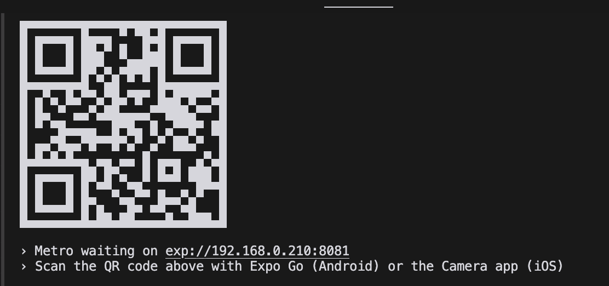
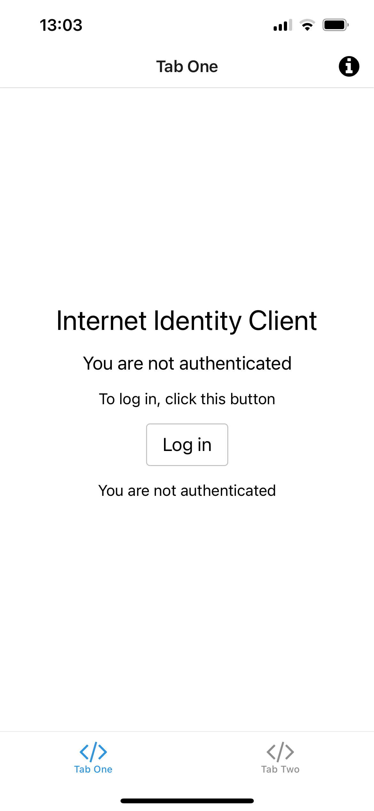
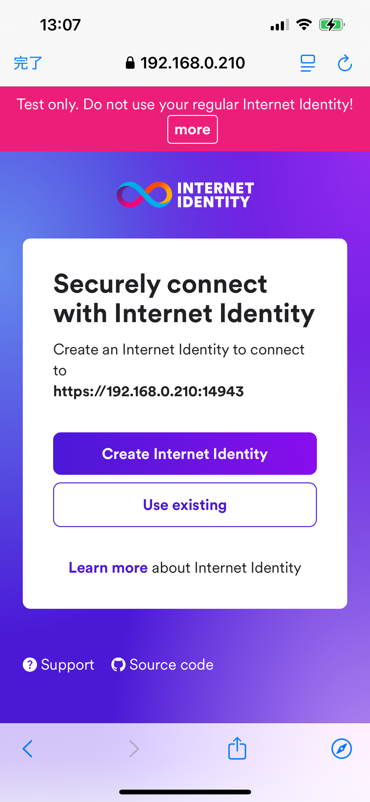
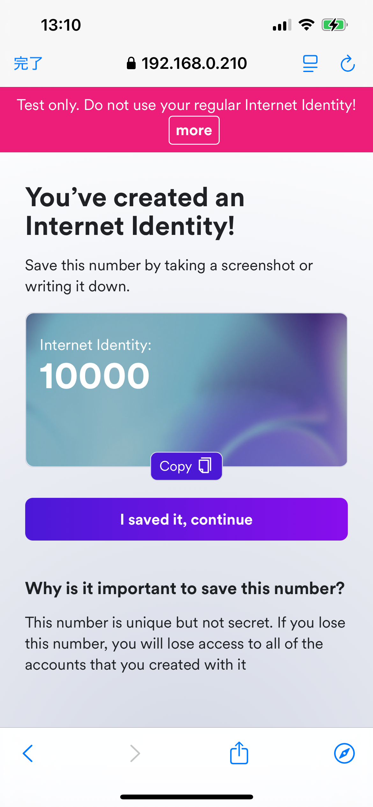
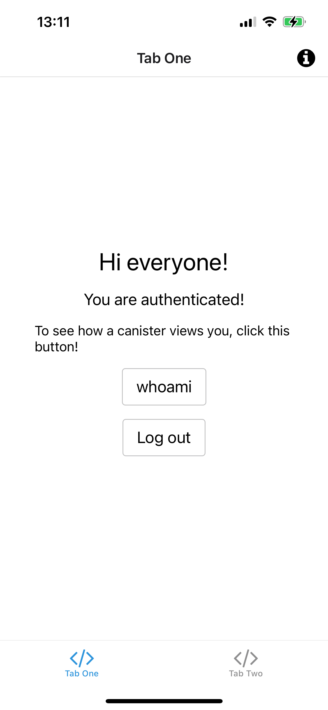
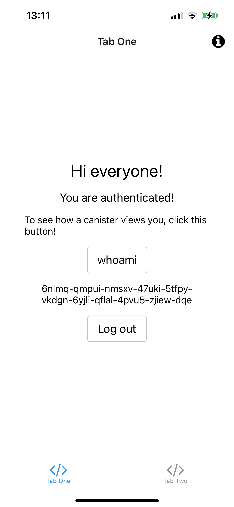
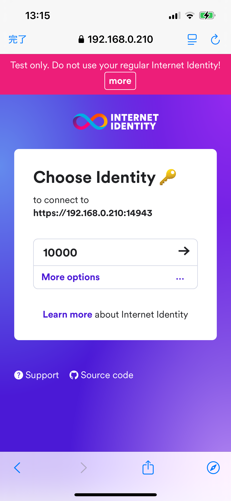
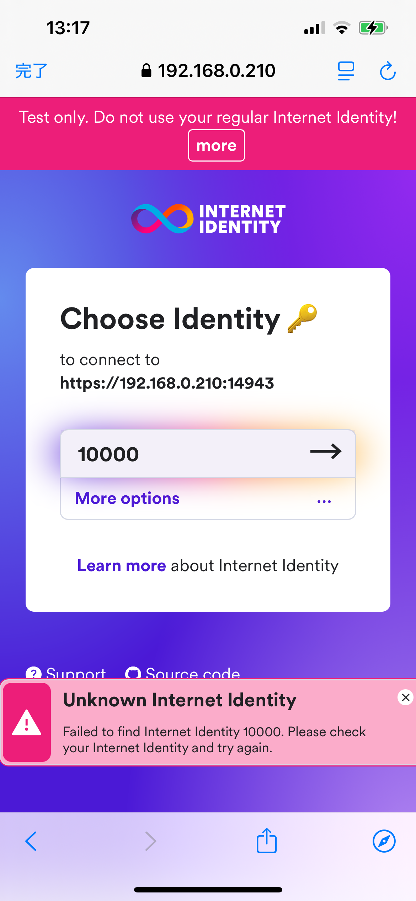
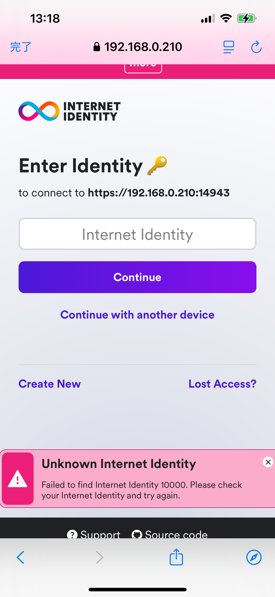

# セットアップ手順

英語版は[こちら](setup.md)です。

## 必要な環境
- Node.jsバージョン18以上が必要です

## Expo Goのインストール
お使いの端末に「Expo Go」アプリをインストールしてください：
- iPhone/iPadをお使いの方：App Storeからインストール
- Androidをお使いの方：Google Play Storeからインストール

## mkcertのインストール
mkcertは、ローカル開発環境でHTTPS通信を簡単に実現するためのツールです。
mkcertのインストール方法と設定手順を説明します。

### macOSでのインストール
```bash
brew install mkcert
brew install nss # Firefoxを使用する場合は必要
```

### ルート認証局の設定
```bash
mkcert -install
```

### ルート証明書の場所確認
```bash
mkcert -CAROOT
```

### iOSでのルート証明書のインストール
- rootCA.pemファイルをiOSデバイスに送信
- 設定アプリで「プロファイルがダウンロードされました」からインストール
- 設定→一般→情報→証明書信頼設定でmkcert証明書を有効化

### Androidでのルート証明書のインストール
- rootCA.pemファイルをAndroidデバイスに転送
- 設定→セキュリティ→その他→ストレージからインストール
- CA証明書として選択してインストール

**重要な注意点**
- Firefoxを使用する場合は必ずnssのインストールが必要
- 作成された鍵ファイルは絶対に共有しない
- Androidは、機種によって、ルート証明書のインストール方法が異なる場合がある

## tigedのインストール
tigedは、GitHubリポジトリの一部分だけを簡単にダウンロードできる便利なツールです。
下記のコマンドを実行して、tigedをインストールします：
```bash
npm install -g tiged
```

## expo-starterプロジェクトのダウンロード
以下のコマンドで、expo-starterプロジェクトをダウンロードし、プロジェクトフォルダに移動します：
```bash
tiged higayasuo/icp-examples/expo-starter expo-starter
cd expo-starter
```

## RustとICPの開発ツールのセットアップ
RustとICPの開発ツールをセットアップする手順を説明します。

### コマンド実行
以下のコマンドを実行して、RustとICPの開発ツールをセットアップします：
```bash
./scripts/setup.sh
```

### セットアップ確認
セットアップが正常に完了したかを確認するため、以下のコマンドを実行します：
```bash
rustc -V
dfx -V
```

両方のコマンドがバージョン情報を表示すれば、セットアップは成功です。

**注意点**：
- バージョン確認時は「V」は必ず大文字で入力してください
- セットアップには数分かかる場合があります
- セットアップ終了後、`exec $SHELL -l`を実行して、シェルのパスを更新してください

## サブプロジェクトのセットアップ
expo-starterプロジェクトには、いくつかのサブプロジェクトで構成されています。
下記のコマンドで、サブプロジェクトのセットアップを行います：
```bash
npm run setup
```

## 固定IPアドレスの設定
PCの開発サーバーにスマートフォンからアクセスするために、固定のIPアドレスを設定します。
これにより、PCを再起動してもIPアドレスが変更されず、安定した接続が可能になります。

### macOS
1. アップルメニューから「システム設定」を開きます

2. サイドバーで「ネットワーク」をクリックします

3. 使用中のネットワーク接続（Wi-FiまたはEthernet）を選択し、「詳細」をクリックします

4. 「TCP/IP」タブを開きます

5. 「IPv4を構成」のプルダウンメニューから「DHCPサーバを使用(アドレスは手入力)」を選択し、以下の情報を入力します：
    - IPアドレス
      - DHCPの動的割り当てと被りにくい、192.168.0.200-192.168.0.254の範囲で設定するのがおすすめです。
      例えば、192.168.0.210を使うといいでしょう。

## サーバー証明書の作成手順
先ほど設定した固定IPアドレスにHTTPSで通信するために、サーバー証明書を作成します。

### 準備
```bash
mkdir .mkcert
cd .mkcert
```
証明書保管用の専用フォルダを作成し、移動します。

### 証明書の作成
```bash
mkcert [固定IPアドレス]
```
以下のファイルが生成されます：
- [固定IPアドレス].pem - サーバー証明書
- [固定IPアドレス]-key.pem - 秘密鍵

### 完了
```bash
cd ..
```
元のフォルダに戻ります。

**重要な注意点**
- 証明書の有効期間は27か月です
- 秘密鍵は絶対に共有しないでください
- 証明書は安全な場所に保管してください

## local-ssl-proxyの設定
package.jsonのssl:canisters, ssl:ii, ssl:webのエントリを、自分で設定した固定IPアドレスに変更します。

### package.jsonへの更新
```json
{
  "scripts": {
    "ssl:canisters": "local-ssl-proxy --key ./.mkcert/[静的IPアドレス]-key.pem --cert ./.mkcert/[静的IPアドレス].pem --source 14943 --target 4943",
    "ssl:ii": "local-ssl-proxy --key ./.mkcert/[静的IPアドレス]-key.pem --cert ./.mkcert/[静的IPアドレス].pem --source 24943 --target 4943",
    "ssl:web": "local-ssl-proxy --key ./.mkcert/[静的IPアドレス]-key.pem --cert ./.mkcert/[静的IPアドレス].pem --source 18081 --target 8081"
  }
}
```

各設定の内容は下記のことをしています：
- `--key`：秘密鍵ファイルのパスを指定します
- `--cert`：サーバー証明書ファイルのパスを指定します
- `--source`：HTTPSでアクセスする際のポート番号です
- `--target`：実際の開発サーバーが動作しているポート番号です

**重要な注意点**
- [固定IPアドレス]は、先ほど設定した固定IPアドレスに置き換えてください
- サーバー証明書と秘密鍵のファイルパスは、mkcertで生成したファイルの場所と一致させてください

## ローカルreplicaの起動
ローカルでCanisterを動かす実行環境のことをローカルreplicaと呼びます。
新しいターミナルを立ち上げて、以下のコマンドを実行します：
```bash
npm run dfx:start
```
ローカルreplicaが、4943番ポートで起動します

### ローカルreplicaの停止方法
ローカルreplicaを停止するには、以下のいずれかの方法を使用します：
- 起動中のターミナルでCtrl+Cを押します
- 別のターミナルで`dfx stop`コマンドを実行します

**重要な注意点**
`Error: dfx is already running.`というエラーが出た場合は、すでに、dfx startを実行している可能性が高いです。一度、dfx stopでローカルreplicaを停止してから、再度、開発サーバを立ち上げてください。

## Canisterのデプロイ for local
ローカルreplicaに、Canisterをデプロイするには、以下のコマンドを実行します：
```bash
npm run dfx:deploy
```
このコマンドは下記のことをしています：
1. 全てのCanister（internet-identity, ii-integration, expo-starter-frontend, expo-starter-backend）をビルドします
2. ビルドしたCanisterをローカルreplicaにインストールします

**重要な注意点**
- デプロイ前にdfx:startが実行されている必要があります
- デプロイには数分かかる場合があります

## Canisterのデプロイ for playground
playgroundに、Canisterをデプロイするには、以下のコマンドを実行します：
```bash
npm run dfx:deploy:playgorund
```
このコマンドは下記のことをしています：
1. 全てのCanister（internet-identity, ii-integration, expo-starter-frontend, expo-starter-backend）をビルドします
2. ビルドしたCanisterをplaygroundにインストールします

**重要な注意点**
- デプロイには数分かかる場合があります
- デプロイされたCanisterは20分後に期限切れになります
- Playgroundデプロイメントには以下の制限があります：
  - メモリ使用量の上限は1GB
  - サイクル転送命令は無視されます
  - Wasmファイルをgzip圧縮することはできません

## ICPメインネット(ic)へのデプロイ準備手順

1. 開発用のidentityを作成して切り替えます
```bash
dfx identity new dev
dfx identity use dev
```

2. アカウント情報を確認します
```bash
dfx ledger account-id
dfx identity get-principal
```

3. デプロイに必要な準備をします
- 表示されたAccount IDに少量のICPを送金します（5ICPくらいはあった方が無難）
- 送金後、以下のコマンドでCanisterを作成します
```bash
dfx ledger --network ic create-canister $(dfx identity get-principal) --amount 4
```

4. Cyclesウォレットを設定します
```bash
dfx identity --ic deploy-wallet <作成されたCycles Wallet Canister ID>
dfx identity --network ic set-wallet <作成されたCycles Wallet Canister ID>
```

**重要な注意点**
- デプロイには以下が必要です：
  - ウォレット作成用のICP
  - Canisterデプロイ用のCycles

## 開発者の秘密鍵のバックアップと復元

### 秘密鍵のエクスポート
```bash
dfx identity export dev > dev.pem
```
このコマンドは、devアイデンティティの秘密鍵をPEMフォーマットでdev.pemファイルに保存します。

### 秘密鍵のインポート
```bash
dfx identity import dev dev.pem
```
エクスポートしたPEMファイルから秘密鍵をインポートし、devアイデンティティとして登録します。

**重要な注意点**
- インポート時にパスフレーズの入力を求められます
- パスフレーズは8文字以上である必要があります
- パスフレーズは忘れないように安全に保管してください
- PEMファイルは秘密鍵を含むため、セキュアに保管する必要があります
- インポート完了後、不要なPEMファイルは安全に削除することを推奨します

## Canisterのデプロイ for ic
icに、Canisterをデプロイするには、以下のコマンドを実行します：
```bash
npm run dfx:deploy:ic
```
このコマンドは下記のことをしています：
1. 全てのCanister（internet-identity, ii-integration, expo-starter-frontend, expo-starter-backend）をビルドします
2. ビルドしたCanisterをicにインストールします

**重要な注意点**
- デプロイには数分かかる場合があります
- メインネットへのデプロイには、運用のためのサイクル（実行手数料）が必要です

補足説明：
- サイクルは、Internet Computer上でCanisterを実行するために必要な計算リソースの支払い単位です
- メインネットでは、Canisterの実行時間、メモリ使用量、ネットワーク通信量に応じてサイクルが消費されます
- サイクルはICPトークンから変換して取得することができます

## local-ssl-proxyの起動
local-ssl-proxyの起動方法を説明します

### 起動コマンド
```bash
npm run ssl:canisters
npm run ssl:ii
npm run ssl:web
```
これらのコマンドは下記のことをしています：
1. ssl:canistersはCanister用のHTTPS接続を提供します（14943→4943）
2. ssl:iiはInternet Identity用のHTTPS接続を提供します（24943→4943）
3. ssl:webはWebアプリ用のHTTPS接続を提供します（18081→8081）

**重要な注意点**
- 各コマンドは必ず別々の新しいターミナルで実行してください
- コマンドを実行する前に、対象のポートが使用されていないことを確認してください
- SSL証明書のパスが正しく設定されていることを確認してください
- 起動後はCtrl+Cで個別に停止できます

## Expo開発サーバーの起動
Expo開発サーバーの起動方法を説明します

### 起動コマンド
```bash
npm run frontend:start
```
このコマンドを実行すると下記のことが行われます：
1. Expoの開発者サーバーが起動します
2. QRコードが表示されます
3. 操作用のメニューが表示されます

### 主な操作方法
- `w`キー：Webブラウザでアプリを起動します

### スマートフォンでの実行方法
1. Expo Goアプリをインストールします
2. iOSの場合：カメラアプリでQRコードを読み取ります
3. Androidの場合：Expo GoアプリでQRコードを読み取ります

**重要な注意点**
- PCとスマートフォンは同じWi-Fiに接続してください
- Expo開発サーバーの停止はCtrl+Cで行います

**Androidの制限事項**
- Androidでは、ローカルのInternet Identityは動作しません
- メインネットのInternet Identityは動作します
- Expo Goでのテストは、iOSで行ってください

## 稼働確認
Expo Goを使って実際にアプリを使ってみましょう。

1. Expo開発サーバーを起動したときに表示されたQRコードをiOSのカメラで読み取り、Expoアプリを起動します。


2. Expoアプリのログインボタンをタップし、ii-integrationのWebアプリを起動します。


3. ii-integrationのログインボタンをタップし、Internet Identityを起動します。


4. Internet Identity作成ボタンをタップし、Internet Identityを作成します。


5. Internet Identityが作成されました。
開発環境では、10000で作成されます。この数字は、Internet Identityを表していて、本番環境では、覚えておく必要があります。
I saved it, continueボタンをクリックすると、Expoアプリに戻ります。


6. Expoアプリから、Backend Canisterのwhoamiメソッドを呼び出しましょう。whoamiボタンをタップします。すると、あなたのInternet Identity(ログインアカウント)のテキスト表現を見ることができます。
他のブロックチェーンのアドレスに相当します。



7. ログアウトしてから再度ログインしてください。
Choose Identityのページが表示されます。先ほど作成した10000を選べば、再ログインできます。


8. Choose IdentityでIdentityを選んだときに、Unknown Internet Identityのエラーが出る場合があります。
これは、Identityを作成後に、ローカルInternet Identityを再デプロイしたときに起こります。
ブラウザは、Identityを覚えていますが、ローカルInternet IdentityはIdentityを忘れてしまっているためです。


9. このような場合は、Identityの下に表示されているMore optionsをタップしてください。左下のCreate Newボタンをタップしましょう。10000のIdentityを再作成できます。



